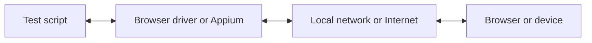

باستخدام WebdriverIO، يمكنك الاختيار بين عدة تقنيات أتمتة عند تشغيل اختبارات E2E محليًا أو في السحابة. افتراضيًا، سيحاول WebdriverIO بدء جلسة أتمتة محلية باستخدام بروتوكول [WebDriver Bidi](https://w3c.github.io/webdriver-bidi/).

## بروتوكول WebDriver Bidi

[WebDriver Bidi](https://w3c.github.io/webdriver-bidi/) هو بروتوكول أتمتة لأتمتة المتصفحات باستخدام الاتصال ثنائي الاتجاه. وهو خليفة بروتوكول [WebDriver](https://w3c.github.io/webdriver/)، ويتيح قدرات فحص أكثر بكثير لحالات استخدام الاختبار المختلفة.

هذا البروتوكول قيد التطوير حاليًا، وقد تُضاف إليه عناصر أساسية جديدة في المستقبل. وقد التزم جميع مطوري المتصفحات بتطبيق معيار الويب هذا، كما أن كثيرًا من [العناصر الأساسية](https://wpt.fyi/results/webdriver/tests/bidi?label=experimental&label=master&aligned) قد طُبّقت بالفعل في المتصفحات.

## بروتوكول WebDriver

> [WebDriver](https://w3c.github.io/webdriver/) هو واجهة تحكم عن بُعد تتيح فحص وكلاء المستخدم (user agents) والتحكم بهم. ويوفر بروتوكول اتصال محايدًا من حيث المنصة واللغة، كوسيلة تتيح للبرامج العاملة خارج العملية توجيه سلوك متصفحات الويب عن بُعد.

صُمّم بروتوكول WebDriver لأتمتة المتصفح من منظور المستخدم، أي أن كل ما يستطيع المستخدم فعله، يمكنك فعله بالمتصفح. ويوفر مجموعة من الأوامر التي تُجرّد التفاعلات الشائعة مع التطبيق (مثل التنقل، أو النقر، أو قراءة حالة عنصر ما). ولأنه معيار ويب، فهو مدعوم جيدًا لدى جميع مطوري المتصفحات الرئيسيين، كما يُستخدم أيضًا كبروتوكول أساسي لأتمتة الأجهزة المحمولة باستخدام [Appium](http://appium.io).

لاستخدام بروتوكول الأتمتة هذا، تحتاج إلى خادم وسيط (proxy) يترجم جميع الأوامر وينفذها في البيئة المستهدفة (أي المتصفح أو تطبيق الهاتف المحمول).

بالنسبة لأتمتة المتصفحات، يكون الخادم الوسيط عادةً هو مُشغّل المتصفح (browser driver). وتتوفر مُشغّلات لجميع المتصفحات:

- Chrome – [ChromeDriver](http://chromedriver.chromium.org/downloads)
- Firefox – [Geckodriver](https://github.com/mozilla/geckodriver/releases)
- Microsoft Edge – [Edge Driver](https://developer.microsoft.com/en-us/microsoft-edge/tools/webdriver/)
- Internet Explorer – [InternetExplorerDriver](https://github.com/SeleniumHQ/selenium/wiki/InternetExplorerDriver)
- Safari – [SafariDriver](https://developer.apple.com/documentation/webkit/testing_with_webdriver_in_safari)

لأي نوع من أتمتة الأجهزة المحمولة، ستحتاج إلى تثبيت [Appium](http://appium.io) وإعداده. وسيتيح لك ذلك أتمتة تطبيقات الأجهزة المحمولة (iOS/Android) أو حتى تطبيقات سطح المكتب (macOS/Windows) باستخدام إعداد WebdriverIO نفسه.

هناك أيضًا العديد من الخدمات التي تتيح لك تشغيل اختبارات الأتمتة في السحابة على نطاق واسع. فبدلًا من الاضطرار إلى إعداد جميع هذه المُشغّلات محليًا، يمكنك ببساطة التواصل مع هذه الخدمات (مثل [Sauce Labs](https://saucelabs.com)) في السحابة وفحص النتائج على منصتها. يبدو الاتصال بين سكربت الاختبار وبيئة الأتمتة على النحو التالي:

