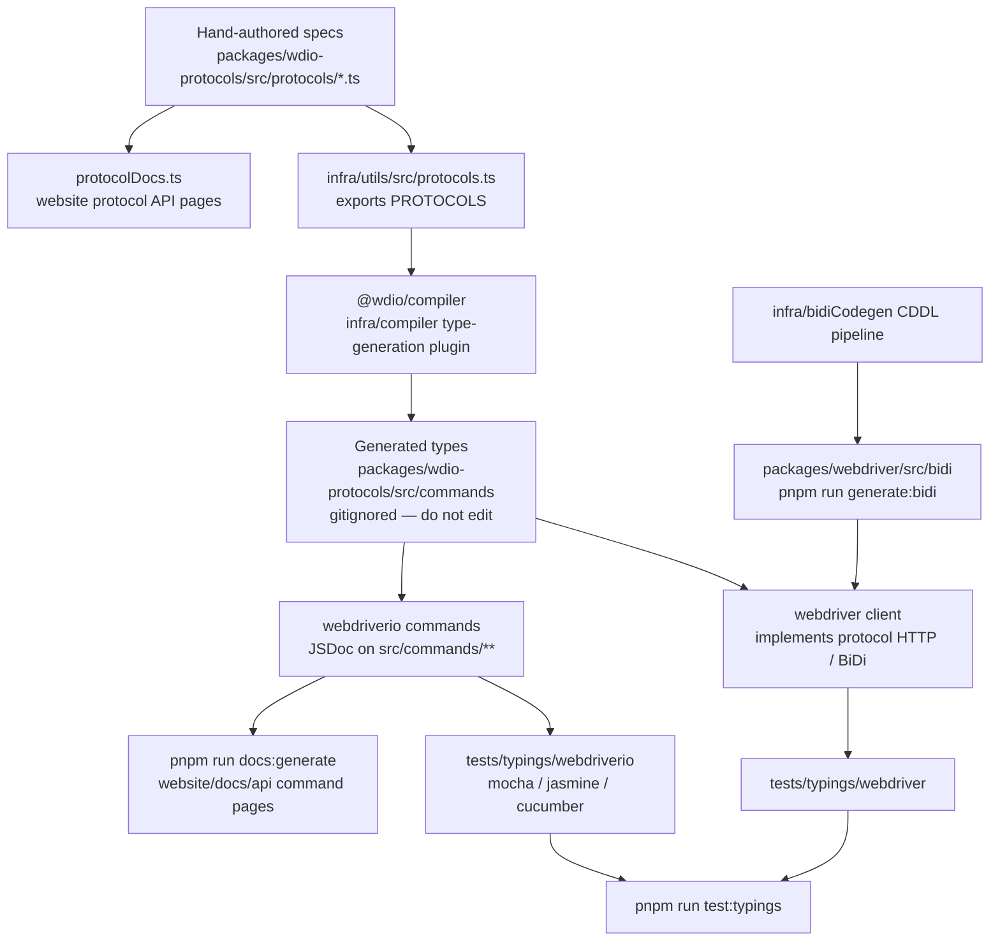

كيف تتحول مواصفات البروتوكول إلى أنواع TypeScript واختبارات الأنواع (typings) ووثائق API.
ملاحظة للوكلاء (Agents): لا تعدّل الملفات المُولَّدة يدويًا — بل غيّر المصدر الموضح في هذا المخطط
ثم أعد التوليد.

## ما الذي يجب تعديله

| ما تريد تغييره | عدّل هذا | ثم شغّل |
|--------------------|-----------|----------|
| شكل أمر WebDriver / Appium / خاص بمورّد معيّن | `packages/wdio-protocols/src/protocols/*.ts` | `pnpm run compile:all` و `pnpm run test:typings:webdriver` |
| أمر `browser.*` / `$().*` موجّه للمستخدم | `packages/webdriverio/src/commands/**` بالإضافة إلى اختبار الوحدة الخاص به ومقتطف الأنواع (typings) | `pnpm run test:package webdriverio` و `pnpm run test:typings:webdriverio` |
| أنواع BiDi | `infra/bidiCodegen/` | `pnpm run generate:bidi` |
| نص وثائق API للأوامر | تعليقات JSDoc على أمر webdriverio | `pnpm run docs:generate` |
| نص وثائق API للبروتوكول | الحقلان `description` / `ref` في مواصفة البروتوكول | `pnpm run docs:generate` |

انظر أيضًا [نظرة عامة عالية المستوى](/docs/flowcharts/highleveloverview). مواصفات البروتوكول
مملوكة للحزمة `packages/wdio-protocols`؛ أما إضافة المُصرِّف (compiler plugin) فتوجد في
`infra/compiler/src/type-generation`.