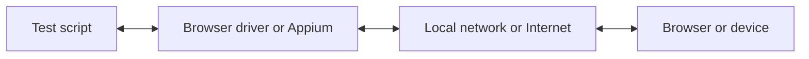

Mit WebdriverIO können Sie zwischen mehreren Automatisierungstechnologien wählen, wenn Sie Ihre E2E-Tests lokal oder in der Cloud ausführen. Standardmäßig versucht WebdriverIO, eine lokale Automatisierungssitzung mit dem [WebDriver Bidi](https://w3c.github.io/webdriver-bidi/)-Protokoll zu starten.

## WebDriver Bidi Protokoll

[WebDriver Bidi](https://w3c.github.io/webdriver-bidi/) ist ein Automatisierungsprotokoll zur Automatisierung von Browsern mittels bidirektionaler Kommunikation. Es ist der Nachfolger des [WebDriver](https://w3c.github.io/webdriver/)-Protokolls und ermöglicht deutlich mehr Introspektionsmöglichkeiten für verschiedene Testanwendungsfälle.

Dieses Protokoll befindet sich derzeit in der Entwicklung, und in Zukunft könnten neue Primitive hinzugefügt werden. Alle Browserhersteller haben sich verpflichtet, diesen Webstandard zu implementieren, und viele [Primitive](https://wpt.fyi/results/webdriver/tests/bidi?label=experimental&label=master&aligned) wurden bereits in Browsern umgesetzt.

## WebDriver Protokoll

> [WebDriver](https://w3c.github.io/webdriver/) ist eine Fernsteuerungsschnittstelle, die die Introspektion und Steuerung von User Agents ermöglicht. Sie stellt ein plattform- und sprachneutrales Wire-Protokoll bereit, mit dem Programme außerhalb des Prozesses das Verhalten von Webbrowsern aus der Ferne steuern können.

Das WebDriver-Protokoll wurde entwickelt, um einen Browser aus der Perspektive des Benutzers zu automatisieren, d. h. alles, was ein Benutzer tun kann, können Sie auch mit dem Browser tun. Es stellt eine Reihe von Befehlen bereit, die gängige Interaktionen mit einer Anwendung abstrahieren (z. B. Navigieren, Klicken oder Auslesen des Zustands eines Elements). Da es ein Webstandard ist, wird es von allen großen Browserherstellern gut unterstützt und dient auch als zugrunde liegendes Protokoll für die mobile Automatisierung mit [Appium](http://appium.io).

Um dieses Automatisierungsprotokoll zu verwenden, benötigen Sie einen Proxy-Server, der alle Befehle übersetzt und in der Zielumgebung (d. h. im Browser oder in der mobilen App) ausführt.

Für die Browserautomatisierung ist der Proxy-Server normalerweise der Browsertreiber. Für alle Browser sind Treiber verfügbar:

- Chrome – [ChromeDriver](http://chromedriver.chromium.org/downloads)
- Firefox – [Geckodriver](https://github.com/mozilla/geckodriver/releases)
- Microsoft Edge – [Edge Driver](https://developer.microsoft.com/en-us/microsoft-edge/tools/webdriver/)
- Internet Explorer – [InternetExplorerDriver](https://github.com/SeleniumHQ/selenium/wiki/InternetExplorerDriver)
- Safari – [SafariDriver](https://developer.apple.com/documentation/webkit/testing_with_webdriver_in_safari)

Für jede Art der mobilen Automatisierung müssen Sie [Appium](http://appium.io) installieren und einrichten. Damit können Sie mobile (iOS/Android) oder sogar Desktop-Anwendungen (macOS/Windows) mit demselben WebdriverIO-Setup automatisieren.

Es gibt auch zahlreiche Dienste, mit denen Sie Ihre Automatisierungstests in großem Maßstab in der Cloud ausführen können. Anstatt all diese Treiber lokal einrichten zu müssen, können Sie einfach mit diesen Diensten (z. B. [Sauce Labs](https://saucelabs.com)) in der Cloud kommunizieren und die Ergebnisse auf deren Plattform einsehen. Die Kommunikation zwischen dem Testskript und der Automatisierungsumgebung sieht wie folgt aus:

