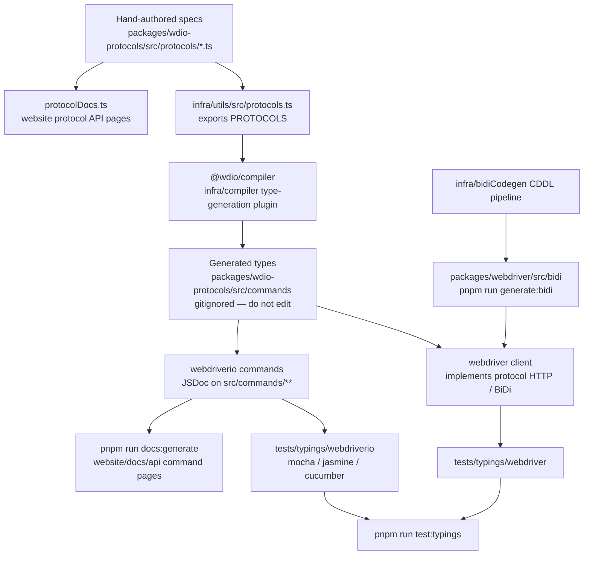

Wie aus Protokollspezifikationen TypeScript-Typen, Typisierungstests und API-Dokumentation werden.
Agents: Generierte Dateien nicht manuell bearbeiten – ändere die Quelle in diesem Diagramm
und generiere neu.

## Was bearbeitet werden muss

| Du möchtest ändern | Bearbeite dies | Führe dann aus |
|--------------------|-----------|----------|
| Die Struktur eines WebDriver- / Appium- / Hersteller-Befehls | `packages/wdio-protocols/src/protocols/*.ts` | `pnpm run compile:all` und `pnpm run test:typings:webdriver` |
| Einen nutzerseitigen `browser.*` / `$().*` Befehl | `packages/webdriverio/src/commands/**` sowie den zugehörigen Unit-Test und das Typisierungs-Snippet | `pnpm run test:package webdriverio` und `pnpm run test:typings:webdriverio` |
| BiDi-Typen | `infra/bidiCodegen/` | `pnpm run generate:bidi` |
| Text der Befehls-API-Dokumentation | JSDoc des webdriverio-Befehls | `pnpm run docs:generate` |
| Text der Protokoll-API-Dokumentation | `description` / `ref` der Protokollspezifikation | `pnpm run docs:generate` |

Siehe auch [Überblick auf hoher Ebene](/docs/flowcharts/highleveloverview). Die Protokollspezifikationen
gehören zu `packages/wdio-protocols`; das Compiler-Plugin befindet sich in
`infra/compiler/src/type-generation`.