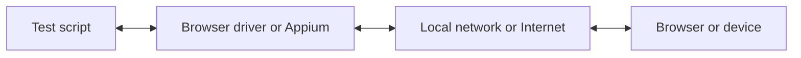

Με το WebdriverIO, μπορείτε να επιλέξετε ανάμεσα σε πολλαπλές τεχνολογίες αυτοματοποίησης όταν εκτελείτε τις E2E δοκιμές σας τοπικά ή στο cloud. Από προεπιλογή, το WebdriverIO θα προσπαθήσει να ξεκινήσει μια τοπική συνεδρία αυτοματοποίησης χρησιμοποιώντας το πρωτόκολλο [WebDriver Bidi](https://w3c.github.io/webdriver-bidi/).

## Πρωτόκολλο WebDriver Bidi

Το [WebDriver Bidi](https://w3c.github.io/webdriver-bidi/) είναι ένα πρωτόκολλο αυτοματοποίησης για την αυτοματοποίηση προγραμμάτων περιήγησης με χρήση αμφίδρομης επικοινωνίας. Είναι ο διάδοχος του πρωτοκόλλου [WebDriver](https://w3c.github.io/webdriver/) και παρέχει πολύ περισσότερες δυνατότητες ενδοσκόπησης για διάφορες περιπτώσεις χρήσης δοκιμών.

Αυτό το πρωτόκολλο βρίσκεται αυτή τη στιγμή υπό ανάπτυξη και νέα primitives ενδέχεται να προστεθούν στο μέλλον. Όλοι οι κατασκευαστές προγραμμάτων περιήγησης έχουν δεσμευτεί να υλοποιήσουν αυτό το πρότυπο του web και πολλά [primitives](https://wpt.fyi/results/webdriver/tests/bidi?label=experimental&label=master&aligned) έχουν ήδη ενσωματωθεί στα προγράμματα περιήγησης.

## Πρωτόκολλο WebDriver

> Το [WebDriver](https://w3c.github.io/webdriver/) είναι μια διεπαφή απομακρυσμένου ελέγχου που επιτρέπει την ενδοσκόπηση και τον έλεγχο των user agents. Παρέχει ένα wire protocol ανεξάρτητο από πλατφόρμα και γλώσσα, ως τρόπο ώστε προγράμματα εκτός διεργασίας να καθοδηγούν απομακρυσμένα τη συμπεριφορά των προγραμμάτων περιήγησης.

Το πρωτόκολλο WebDriver σχεδιάστηκε για να αυτοματοποιεί ένα πρόγραμμα περιήγησης από την οπτική του χρήστη, που σημαίνει ότι οτιδήποτε μπορεί να κάνει ένας χρήστης, μπορείτε να το κάνετε και εσείς με το πρόγραμμα περιήγησης. Παρέχει ένα σύνολο εντολών που αφαιρούν την πολυπλοκότητα των συνηθισμένων αλληλεπιδράσεων με μια εφαρμογή (π.χ. πλοήγηση, κλικ ή ανάγνωση της κατάστασης ενός στοιχείου). Καθώς πρόκειται για πρότυπο του web, υποστηρίζεται ευρέως από όλους τους μεγάλους κατασκευαστές προγραμμάτων περιήγησης και χρησιμοποιείται επίσης ως υποκείμενο πρωτόκολλο για την αυτοματοποίηση κινητών συσκευών μέσω του [Appium](http://appium.io).

Για να χρησιμοποιήσετε αυτό το πρωτόκολλο αυτοματοποίησης, χρειάζεστε έναν proxy server που μεταφράζει όλες τις εντολές και τις εκτελεί στο περιβάλλον-στόχο (δηλαδή στο πρόγραμμα περιήγησης ή στην εφαρμογή κινητού).

Για την αυτοματοποίηση προγραμμάτων περιήγησης, ο proxy server είναι συνήθως ο driver του προγράμματος περιήγησης. Υπάρχουν διαθέσιμοι drivers για όλα τα προγράμματα περιήγησης:

- Chrome – [ChromeDriver](http://chromedriver.chromium.org/downloads)
- Firefox – [Geckodriver](https://github.com/mozilla/geckodriver/releases)
- Microsoft Edge – [Edge Driver](https://developer.microsoft.com/en-us/microsoft-edge/tools/webdriver/)
- Internet Explorer – [InternetExplorerDriver](https://github.com/SeleniumHQ/selenium/wiki/InternetExplorerDriver)
- Safari – [SafariDriver](https://developer.apple.com/documentation/webkit/testing_with_webdriver_in_safari)

Για κάθε είδους αυτοματοποίηση κινητών συσκευών, θα χρειαστεί να εγκαταστήσετε και να ρυθμίσετε το [Appium](http://appium.io). Θα σας επιτρέψει να αυτοματοποιήσετε εφαρμογές κινητών (iOS/Android) ή ακόμη και εφαρμογές desktop (macOS/Windows) χρησιμοποιώντας την ίδια ρύθμιση του WebdriverIO.

Υπάρχουν επίσης πολλές υπηρεσίες που σας επιτρέπουν να εκτελείτε τις δοκιμές αυτοματοποίησής σας στο cloud σε μεγάλη κλίμακα. Αντί να χρειάζεται να ρυθμίσετε όλους αυτούς τους drivers τοπικά, μπορείτε απλώς να επικοινωνήσετε με αυτές τις υπηρεσίες (π.χ. [Sauce Labs](https://saucelabs.com)) στο cloud και να εξετάσετε τα αποτελέσματα στην πλατφόρμα τους. Η επικοινωνία μεταξύ του σεναρίου δοκιμής και του περιβάλλοντος αυτοματοποίησης μοιάζει ως εξής:

