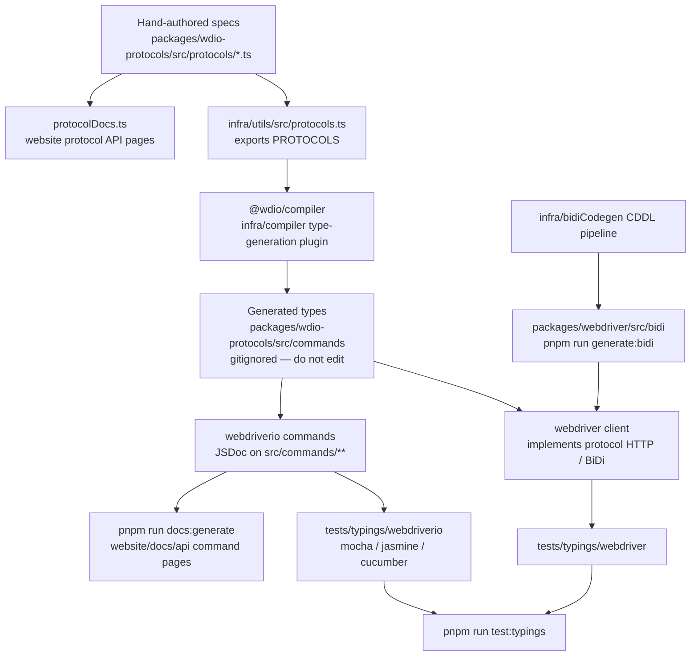

Πώς οι προδιαγραφές πρωτοκόλλων γίνονται τύποι TypeScript, δοκιμές τύπων (typings tests) και τεκμηρίωση API.
Agents: μην επεξεργάζεστε χειροκίνητα τα παραγόμενα αρχεία — αλλάξτε την πηγή σε αυτό το διάγραμμα
και εκτελέστε ξανά τη δημιουργία.

## Τι να επεξεργαστείτε

| Θέλετε να αλλάξετε | Επεξεργαστείτε αυτό | Στη συνέχεια εκτελέστε |
|--------------------|-----------|----------|
| Τη μορφή μιας εντολής WebDriver / Appium / vendor | `packages/wdio-protocols/src/protocols/*.ts` | `pnpm run compile:all` και `pnpm run test:typings:webdriver` |
| Μια εντολή `browser.*` / `$().*` που απευθύνεται στον χρήστη | `packages/webdriverio/src/commands/**` μαζί με το unit test της και το απόσπασμα typings | `pnpm run test:package webdriverio` και `pnpm run test:typings:webdriverio` |
| Τύπους BiDi | `infra/bidiCodegen/` | `pnpm run generate:bidi` |
| Κείμενο τεκμηρίωσης API εντολών | Το JSDoc στην εντολή webdriverio | `pnpm run docs:generate` |
| Κείμενο τεκμηρίωσης API πρωτοκόλλου | Τα `description` / `ref` της προδιαγραφής πρωτοκόλλου | `pnpm run docs:generate` |

Δείτε επίσης την [Επισκόπηση υψηλού επιπέδου](/docs/flowcharts/highleveloverview). Οι προδιαγραφές πρωτοκόλλων
ανήκουν στο `packages/wdio-protocols`· το plugin του compiler βρίσκεται στο
`infra/compiler/src/type-generation`.