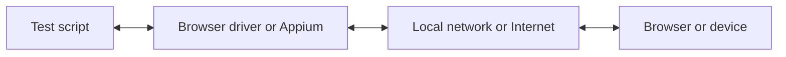

Con WebdriverIO, puedes elegir entre múltiples tecnologías de automatización al ejecutar tus pruebas E2E de forma local o en la nube. De forma predeterminada, WebdriverIO intentará iniciar una sesión de automatización local utilizando el protocolo [WebDriver Bidi](https://w3c.github.io/webdriver-bidi/).

## Protocolo WebDriver Bidi

[WebDriver Bidi](https://w3c.github.io/webdriver-bidi/) es un protocolo de automatización para automatizar navegadores mediante comunicación bidireccional. Es el sucesor del protocolo [WebDriver](https://w3c.github.io/webdriver/) y ofrece muchas más capacidades de introspección para diversos casos de uso de pruebas.

Este protocolo se encuentra actualmente en desarrollo y es posible que se añadan nuevas primitivas en el futuro. Todos los fabricantes de navegadores se han comprometido a implementar este estándar web y muchas [primitivas](https://wpt.fyi/results/webdriver/tests/bidi?label=experimental&label=master&aligned) ya se han incorporado a los navegadores.

## Protocolo WebDriver

> [WebDriver](https://w3c.github.io/webdriver/) es una interfaz de control remoto que permite la introspección y el control de agentes de usuario. Proporciona un protocolo de comunicación neutral en cuanto a plataforma y lenguaje, como medio para que programas fuera del proceso indiquen de forma remota el comportamiento de los navegadores web.

El protocolo WebDriver fue diseñado para automatizar un navegador desde la perspectiva del usuario, lo que significa que todo lo que un usuario puede hacer, tú puedes hacerlo con el navegador. Proporciona un conjunto de comandos que abstraen las interacciones comunes con una aplicación (por ejemplo, navegar, hacer clic o leer el estado de un elemento). Al ser un estándar web, cuenta con un buen soporte en todos los principales fabricantes de navegadores y también se utiliza como protocolo subyacente para la automatización móvil mediante [Appium](http://appium.io).

Para utilizar este protocolo de automatización, necesitas un servidor proxy que traduzca todos los comandos y los ejecute en el entorno de destino (es decir, el navegador o la aplicación móvil).

Para la automatización de navegadores, el servidor proxy suele ser el driver del navegador. Hay drivers disponibles para todos los navegadores:

- Chrome – [ChromeDriver](http://chromedriver.chromium.org/downloads)
- Firefox – [Geckodriver](https://github.com/mozilla/geckodriver/releases)
- Microsoft Edge – [Edge Driver](https://developer.microsoft.com/en-us/microsoft-edge/tools/webdriver/)
- Internet Explorer – [InternetExplorerDriver](https://github.com/SeleniumHQ/selenium/wiki/InternetExplorerDriver)
- Safari – [SafariDriver](https://developer.apple.com/documentation/webkit/testing_with_webdriver_in_safari)

Para cualquier tipo de automatización móvil, necesitarás instalar y configurar [Appium](http://appium.io). Te permitirá automatizar aplicaciones móviles (iOS/Android) o incluso de escritorio (macOS/Windows) utilizando la misma configuración de WebdriverIO.

También existen muchos servicios que te permiten ejecutar tus pruebas de automatización en la nube a gran escala. En lugar de tener que configurar todos estos drivers localmente, simplemente puedes comunicarte con estos servicios (por ejemplo, [Sauce Labs](https://saucelabs.com)) en la nube e inspeccionar los resultados en su plataforma. La comunicación entre el script de prueba y el entorno de automatización se ve así:

