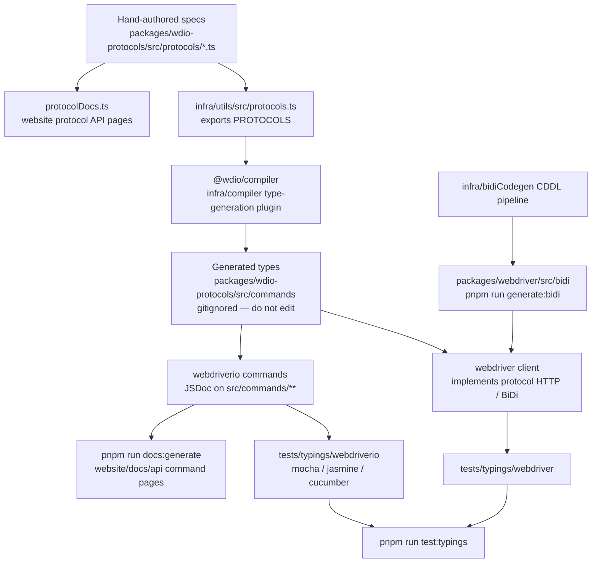

Cómo las especificaciones de protocolo se convierten en tipos de TypeScript, pruebas de tipados y documentación de la API.
Agentes: no editen manualmente los archivos generados; cambien el código fuente indicado en este diagrama
y vuelvan a generarlos.

## Qué editar

| Si quieres cambiar | Edita esto | Luego ejecuta |
|--------------------|-----------|----------|
| La estructura de un comando de WebDriver / Appium / de un proveedor | `packages/wdio-protocols/src/protocols/*.ts` | `pnpm run compile:all` y `pnpm run test:typings:webdriver` |
| Un comando `browser.*` / `$().*` orientado al usuario | `packages/webdriverio/src/commands/**` junto con su prueba unitaria y su fragmento de tipados | `pnpm run test:package webdriverio` y `pnpm run test:typings:webdriverio` |
| Los tipos de BiDi | `infra/bidiCodegen/` | `pnpm run generate:bidi` |
| El texto de la documentación de la API de comandos | El JSDoc del comando de webdriverio | `pnpm run docs:generate` |
| El texto de la documentación de la API de protocolos | La `description` / `ref` de la especificación del protocolo | `pnpm run docs:generate` |

Consulta también [High level overview](/docs/flowcharts/highleveloverview). Las especificaciones de protocolo
pertenecen a `packages/wdio-protocols`; el plugin del compilador se encuentra en
`infra/compiler/src/type-generation`.