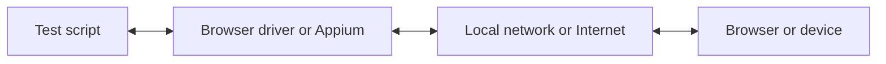

با WebdriverIO می‌توانید هنگام اجرای تست‌های E2E خود به‌صورت محلی یا در فضای ابری، از میان چندین فناوری اتوماسیون انتخاب کنید. به‌طور پیش‌فرض، WebdriverIO تلاش می‌کند یک نشست اتوماسیون محلی را با استفاده از پروتکل [WebDriver Bidi](https://w3c.github.io/webdriver-bidi/) آغاز کند.

## پروتکل WebDriver Bidi

[WebDriver Bidi](https://w3c.github.io/webdriver-bidi/) یک پروتکل اتوماسیون برای خودکارسازی مرورگرها با استفاده از ارتباط دوطرفه است. این پروتکل جانشین پروتکل [WebDriver](https://w3c.github.io/webdriver/) است و قابلیت‌های بازرسی بسیار بیشتری را برای موارد استفاده‌ی مختلف در تست فراهم می‌کند.

این پروتکل در حال حاضر در دست توسعه است و ممکن است در آینده عناصر پایه‌ای (primitives) جدیدی به آن اضافه شوند. همه‌ی سازندگان مرورگرها متعهد به پیاده‌سازی این استاندارد وب شده‌اند و بسیاری از [عناصر پایه‌ای](https://wpt.fyi/results/webdriver/tests/bidi?label=experimental&label=master&aligned) تاکنون در مرورگرها پیاده‌سازی شده‌اند.

## پروتکل WebDriver

> [WebDriver](https://w3c.github.io/webdriver/) یک رابط کنترل از راه دور است که امکان بازرسی و کنترل عامل‌های کاربر (user agents) را فراهم می‌کند. این رابط یک پروتکل ارتباطی مستقل از پلتفرم و زبان ارائه می‌دهد تا برنامه‌های خارج از فرایند بتوانند رفتار مرورگرهای وب را از راه دور هدایت کنند.

پروتکل WebDriver برای خودکارسازی مرورگر از دیدگاه کاربر طراحی شده است، به این معنا که هر کاری که کاربر بتواند انجام دهد، شما نیز می‌توانید با مرورگر انجام دهید. این پروتکل مجموعه‌ای از دستورات را فراهم می‌کند که تعاملات رایج با یک برنامه (مانند پیمایش، کلیک کردن یا خواندن وضعیت یک عنصر) را انتزاعی می‌کنند. از آنجا که این پروتکل یک استاندارد وب است، به‌خوبی توسط همه‌ی سازندگان اصلی مرورگرها پشتیبانی می‌شود و همچنین به‌عنوان پروتکل زیربنایی برای اتوماسیون موبایل با استفاده از [Appium](http://appium.io) به کار می‌رود.

برای استفاده از این پروتکل اتوماسیون، به یک سرور پروکسی نیاز دارید که همه‌ی دستورات را ترجمه کرده و آن‌ها را در محیط هدف (یعنی مرورگر یا اپلیکیشن موبایل) اجرا کند.

برای اتوماسیون مرورگر، سرور پروکسی معمولاً درایور مرورگر است. درایورها برای همه‌ی مرورگرها در دسترس هستند:

- Chrome – [ChromeDriver](http://chromedriver.chromium.org/downloads)
- Firefox – [Geckodriver](https://github.com/mozilla/geckodriver/releases)
- Microsoft Edge – [Edge Driver](https://developer.microsoft.com/en-us/microsoft-edge/tools/webdriver/)
- Internet Explorer – [InternetExplorerDriver](https://github.com/SeleniumHQ/selenium/wiki/InternetExplorerDriver)
- Safari – [SafariDriver](https://developer.apple.com/documentation/webkit/testing_with_webdriver_in_safari)

برای هر نوع اتوماسیون موبایل، باید [Appium](http://appium.io) را نصب و راه‌اندازی کنید. این ابزار به شما امکان می‌دهد اپلیکیشن‌های موبایل (iOS/Android) یا حتی دسکتاپ (macOS/Windows) را با همان پیکربندی WebdriverIO خودکارسازی کنید.

همچنین سرویس‌های زیادی وجود دارند که به شما امکان می‌دهند تست‌های اتوماسیون خود را در مقیاس بالا در فضای ابری اجرا کنید. به‌جای اینکه مجبور باشید همه‌ی این درایورها را به‌صورت محلی راه‌اندازی کنید، می‌توانید به‌سادگی با این سرویس‌ها (مثلاً [Sauce Labs](https://saucelabs.com)) در فضای ابری ارتباط برقرار کرده و نتایج را در پلتفرم آن‌ها بررسی کنید. ارتباط بین اسکریپت تست و محیط اتوماسیون به این شکل است:

