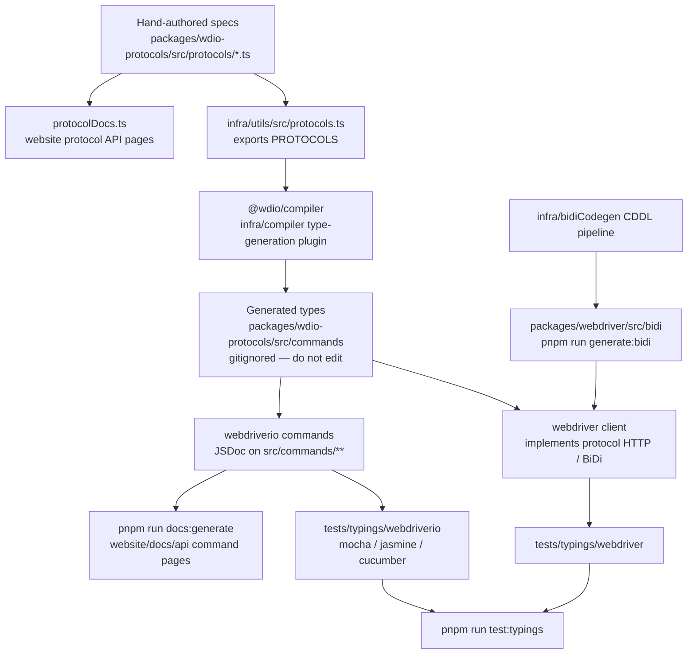

مشخصات پروتکل چگونه به تایپ‌های TypeScript، تست‌های تایپ و مستندات API تبدیل می‌شوند.
ایجنت‌ها: فایل‌های تولیدشده را به‌صورت دستی ویرایش نکنید — منبع را در این نمودار تغییر دهید
و دوباره تولید کنید.

## چه چیزی را ویرایش کنیم

| می‌خواهید تغییر دهید | این را ویرایش کنید | سپس اجرا کنید |
|--------------------|-----------|----------|
| ساختار یک دستور WebDriver / Appium / مخصوص فروشنده | `packages/wdio-protocols/src/protocols/*.ts` | `pnpm run compile:all` و `pnpm run test:typings:webdriver` |
| یک دستور کاربرمحور `browser.*` / `$().*` | `packages/webdriverio/src/commands/**` به‌همراه تست واحد و قطعه‌کد تایپ آن | `pnpm run test:package webdriverio` و `pnpm run test:typings:webdriverio` |
| تایپ‌های BiDi | `infra/bidiCodegen/` | `pnpm run generate:bidi` |
| متن مستندات API دستورات | JSDoc روی دستور webdriverio | `pnpm run docs:generate` |
| متن مستندات API پروتکل | `description` / `ref` در مشخصات پروتکل | `pnpm run docs:generate` |

همچنین [نمای کلی سطح بالا](/docs/flowcharts/highleveloverview) را ببینید. مالکیت مشخصات پروتکل
با `packages/wdio-protocols` است؛ پلاگین کامپایلر در
`infra/compiler/src/type-generation` قرار دارد.