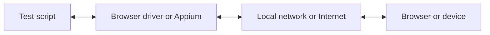

Avec WebdriverIO, vous pouvez choisir entre plusieurs technologies d'automatisation lorsque vous exécutez vos tests E2E en local ou dans le cloud. Par défaut, WebdriverIO tentera de démarrer une session d'automatisation locale en utilisant le protocole [WebDriver Bidi](https://w3c.github.io/webdriver-bidi/).

## Protocole WebDriver Bidi

[WebDriver Bidi](https://w3c.github.io/webdriver-bidi/) est un protocole d'automatisation permettant d'automatiser les navigateurs grâce à une communication bidirectionnelle. Il est le successeur du protocole [WebDriver](https://w3c.github.io/webdriver/) et offre bien plus de capacités d'introspection pour divers cas d'utilisation de tests.

Ce protocole est actuellement en cours de développement et de nouvelles primitives pourraient être ajoutées à l'avenir. Tous les éditeurs de navigateurs se sont engagés à implémenter ce standard web et de nombreuses [primitives](https://wpt.fyi/results/webdriver/tests/bidi?label=experimental&label=master&aligned) ont déjà été intégrées dans les navigateurs.

## Protocole WebDriver

> [WebDriver](https://w3c.github.io/webdriver/) est une interface de contrôle à distance qui permet l'introspection et le contrôle des agents utilisateurs. Il fournit un protocole filaire neutre vis-à-vis de la plateforme et du langage, permettant à des programmes externes de contrôler à distance le comportement des navigateurs web.

Le protocole WebDriver a été conçu pour automatiser un navigateur du point de vue de l'utilisateur, ce qui signifie que tout ce qu'un utilisateur peut faire, vous pouvez le faire avec le navigateur. Il fournit un ensemble de commandes qui abstraient les interactions courantes avec une application (par exemple, naviguer, cliquer ou lire l'état d'un élément). Puisqu'il s'agit d'un standard web, il est bien pris en charge par tous les principaux éditeurs de navigateurs et est également utilisé comme protocole sous-jacent pour l'automatisation mobile avec [Appium](http://appium.io).

Pour utiliser ce protocole d'automatisation, vous avez besoin d'un serveur proxy qui traduit toutes les commandes et les exécute dans l'environnement cible (c'est-à-dire le navigateur ou l'application mobile).

Pour l'automatisation des navigateurs, le serveur proxy est généralement le pilote du navigateur. Des pilotes sont disponibles pour tous les navigateurs :

- Chrome – [ChromeDriver](http://chromedriver.chromium.org/downloads)
- Firefox – [Geckodriver](https://github.com/mozilla/geckodriver/releases)
- Microsoft Edge – [Edge Driver](https://developer.microsoft.com/en-us/microsoft-edge/tools/webdriver/)
- Internet Explorer – [InternetExplorerDriver](https://github.com/SeleniumHQ/selenium/wiki/InternetExplorerDriver)
- Safari – [SafariDriver](https://developer.apple.com/documentation/webkit/testing_with_webdriver_in_safari)

Pour tout type d'automatisation mobile, vous devrez installer et configurer [Appium](http://appium.io). Il vous permettra d'automatiser des applications mobiles (iOS/Android) ou même de bureau (macOS/Windows) en utilisant la même configuration WebdriverIO.

Il existe également de nombreux services qui vous permettent d'exécuter vos tests d'automatisation dans le cloud à grande échelle. Au lieu de devoir configurer tous ces pilotes en local, vous pouvez simplement communiquer avec ces services (par exemple [Sauce Labs](https://saucelabs.com)) dans le cloud et consulter les résultats sur leur plateforme. La communication entre le script de test et l'environnement d'automatisation se présente comme suit :

