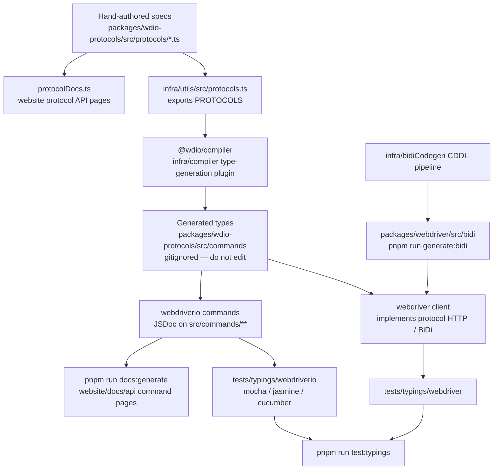

Comment les spécifications de protocole deviennent des types TypeScript, des tests de typage et de la documentation d'API.
Agents : ne modifiez pas manuellement les fichiers générés — modifiez la source indiquée dans ce diagramme
puis régénérez.



## Quoi modifier

| Vous voulez modifier | Modifiez ceci | Puis exécutez |
|--------------------|-----------|----------|
| La forme d'une commande WebDriver / Appium / fournisseur | `packages/wdio-protocols/src/protocols/*.ts` | `pnpm run compile:all` et `pnpm run test:typings:webdriver` |
| Une commande `browser.*` / `$().*` destinée aux utilisateurs | `packages/webdriverio/src/commands/**` ainsi que son test unitaire et son extrait de typage | `pnpm run test:package webdriverio` et `pnpm run test:typings:webdriverio` |
| Les types BiDi | `infra/bidiCodegen/` | `pnpm run generate:bidi` |
| Le texte de la documentation d'API des commandes | Le JSDoc de la commande webdriverio | `pnpm run docs:generate` |
| Le texte de la documentation d'API des protocoles | La `description` / `ref` de la spécification du protocole | `pnpm run docs:generate` |

Voir aussi [Vue d'ensemble](/docs/flowcharts/highleveloverview). Les spécifications de protocole
appartiennent à `packages/wdio-protocols` ; le plugin du compilateur se trouve dans
`infra/compiler/src/type-generation`.
```