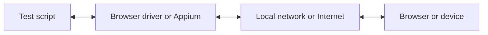

WebdriverIO के साथ, आप अपने E2E टेस्ट को लोकली या क्लाउड में चलाते समय कई ऑटोमेशन तकनीकों में से चुन सकते हैं। डिफ़ॉल्ट रूप से, WebdriverIO [WebDriver Bidi](https://w3c.github.io/webdriver-bidi/) प्रोटोकॉल का उपयोग करके एक लोकल ऑटोमेशन सेशन शुरू करने का प्रयास करेगा।

## WebDriver Bidi प्रोटोकॉल

[WebDriver Bidi](https://w3c.github.io/webdriver-bidi/) द्वि-दिशात्मक (bi-directional) संचार का उपयोग करके ब्राउज़र को ऑटोमेट करने के लिए एक ऑटोमेशन प्रोटोकॉल है। यह [WebDriver](https://w3c.github.io/webdriver/) प्रोटोकॉल का उत्तराधिकारी है और विभिन्न टेस्टिंग उपयोग मामलों के लिए कहीं अधिक इंट्रोस्पेक्शन क्षमताएँ प्रदान करता है।

यह प्रोटोकॉल वर्तमान में विकास के अधीन है और भविष्य में नए प्रिमिटिव जोड़े जा सकते हैं। सभी ब्राउज़र विक्रेताओं ने इस वेब मानक को लागू करने की प्रतिबद्धता जताई है और कई [प्रिमिटिव](https://wpt.fyi/results/webdriver/tests/bidi?label=experimental&label=master&aligned) पहले ही ब्राउज़रों में शामिल किए जा चुके हैं।

## WebDriver प्रोटोकॉल

> [WebDriver](https://w3c.github.io/webdriver/) एक रिमोट कंट्रोल इंटरफ़ेस है जो यूज़र एजेंट्स के इंट्रोस्पेक्शन और नियंत्रण को सक्षम बनाता है। यह आउट-ऑफ़-प्रोसेस प्रोग्रामों के लिए वेब ब्राउज़रों के व्यवहार को दूर से निर्देशित करने के तरीके के रूप में एक प्लेटफ़ॉर्म- और भाषा-निरपेक्ष वायर प्रोटोकॉल प्रदान करता है।

WebDriver प्रोटोकॉल को उपयोगकर्ता के दृष्टिकोण से ब्राउज़र को ऑटोमेट करने के लिए डिज़ाइन किया गया था, जिसका अर्थ है कि उपयोगकर्ता जो कुछ भी कर सकता है, वह सब आप ब्राउज़र के साथ कर सकते हैं। यह कमांड्स का एक सेट प्रदान करता है जो किसी एप्लिकेशन के साथ सामान्य इंटरैक्शन (जैसे, नेविगेट करना, क्लिक करना, या किसी एलिमेंट की स्थिति पढ़ना) को एब्सट्रैक्ट करता है। चूँकि यह एक वेब मानक है, इसलिए सभी प्रमुख ब्राउज़र विक्रेताओं द्वारा इसका अच्छा समर्थन किया जाता है और [Appium](http://appium.io) का उपयोग करके मोबाइल ऑटोमेशन के लिए इसे एक अंतर्निहित प्रोटोकॉल के रूप में भी उपयोग किया जा रहा है।

इस ऑटोमेशन प्रोटोकॉल का उपयोग करने के लिए, आपको एक प्रॉक्सी सर्वर की आवश्यकता होती है जो सभी कमांड्स का अनुवाद करता है और उन्हें लक्षित वातावरण (यानी ब्राउज़र या मोबाइल ऐप) में निष्पादित करता है।

ब्राउज़र ऑटोमेशन के लिए, प्रॉक्सी सर्वर आमतौर पर ब्राउज़र ड्राइवर होता है। सभी ब्राउज़रों के लिए ड्राइवर उपलब्ध हैं:

- Chrome – [ChromeDriver](http://chromedriver.chromium.org/downloads)
- Firefox – [Geckodriver](https://github.com/mozilla/geckodriver/releases)
- Microsoft Edge – [Edge Driver](https://developer.microsoft.com/en-us/microsoft-edge/tools/webdriver/)
- Internet Explorer – [InternetExplorerDriver](https://github.com/SeleniumHQ/selenium/wiki/InternetExplorerDriver)
- Safari – [SafariDriver](https://developer.apple.com/documentation/webkit/testing_with_webdriver_in_safari)

किसी भी प्रकार के मोबाइल ऑटोमेशन के लिए, आपको [Appium](http://appium.io) इंस्टॉल और सेटअप करना होगा। यह आपको उसी WebdriverIO सेटअप का उपयोग करके मोबाइल (iOS/Android) या यहाँ तक कि डेस्कटॉप (macOS/Windows) एप्लिकेशन को ऑटोमेट करने की अनुमति देगा।

ऐसी कई सेवाएँ भी हैं जो आपको अपने ऑटोमेशन टेस्ट को क्लाउड में बड़े पैमाने पर चलाने की अनुमति देती हैं। इन सभी ड्राइवरों को लोकली सेटअप करने के बजाय, आप क्लाउड में इन सेवाओं (जैसे [Sauce Labs](https://saucelabs.com)) से सीधे संवाद कर सकते हैं और उनके प्लेटफ़ॉर्म पर परिणामों का निरीक्षण कर सकते हैं। टेस्ट स्क्रिप्ट और ऑटोमेशन वातावरण के बीच संचार इस प्रकार दिखता है:

