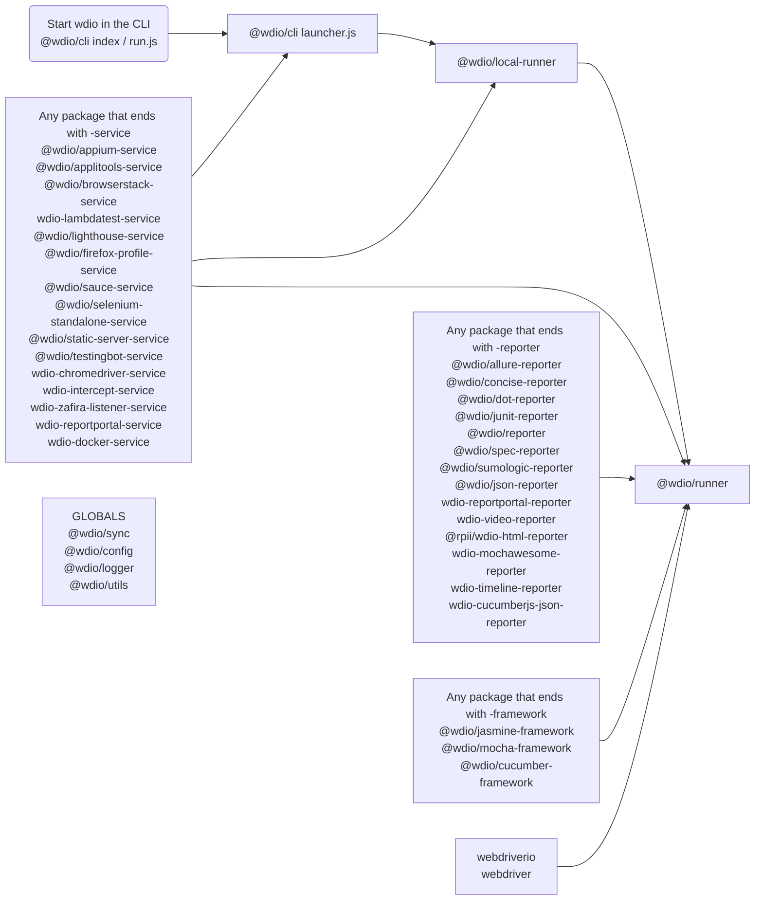

फ़्लो चार्ट इस बात का उच्च स्तरीय अवलोकन प्रदान करता है कि WebdriverIO इकोसिस्टम कोर पैकेजों के साथ कैसे परस्पर क्रिया करता है।

```mermaid
graph LR
    START("Start wdio in the CLI<br> @wdio/cli index / run.js")-->
    LAUNCHER["@wdio/cli launcher.js"]-->
    LOCALRUNNER["@wdio/local-runner"]-->
    RUNNER["@wdio/runner"]
    LISTOFSERVICES["Any package that ends with -service<br>@wdio/appium-service<br>@wdio/applitools-service<br>@wdio/browserstack-service<br>wdio-lambdatest-service<br>@wdio/lighthouse-service<br>@wdio/firefox-profile-service<br>@wdio/sauce-service<br>@wdio/selenium-standalone-service<br>@wdio/static-server-service<br>@wdio/testingbot-service<br>wdio-chromedriver-service<br>wdio-intercept-service<br>wdio-zafira-listener-service<br>wdio-reportportal-service<br>wdio-docker-service"]-->
    LAUNCHER
    LISTOFSERVICES-->LOCALRUNNER
    LISTOFSERVICES-->RUNNER
    REPORTER["Any package that ends with -reporter<br>@wdio/allure-reporter<br>@wdio/concise-reporter<br>@wdio/dot-reporter<br>@wdio/junit-reporter<br>@wdio/reporter<br>@wdio/spec-reporter<br>@wdio/sumologic-reporter<br>@wdio/json-reporter<br>wdio-reportportal-reporter<br>wdio-video-reporter<br>@rpii/wdio-html-reporter<br>wdio-mochawesome-reporter<br>wdio-timeline-reporter<br>wdio-cucumberjs-json-reporter"]-->RUNNER
    FRAMEWORK["Any package that ends with -framework<br>@wdio/jasmine-framework<br>@wdio/mocha-framework<br>@wdio/cucumber-framework<br>"]-->
    RUNNER
    WEBDRIVER["webdriverio<br>webdriver"]-->
    RUNNER
    GLOBAL["GLOBALS<br>@wdio/sync<br>@wdio/config<br>@wdio/logger<br>@wdio/utils"]
```