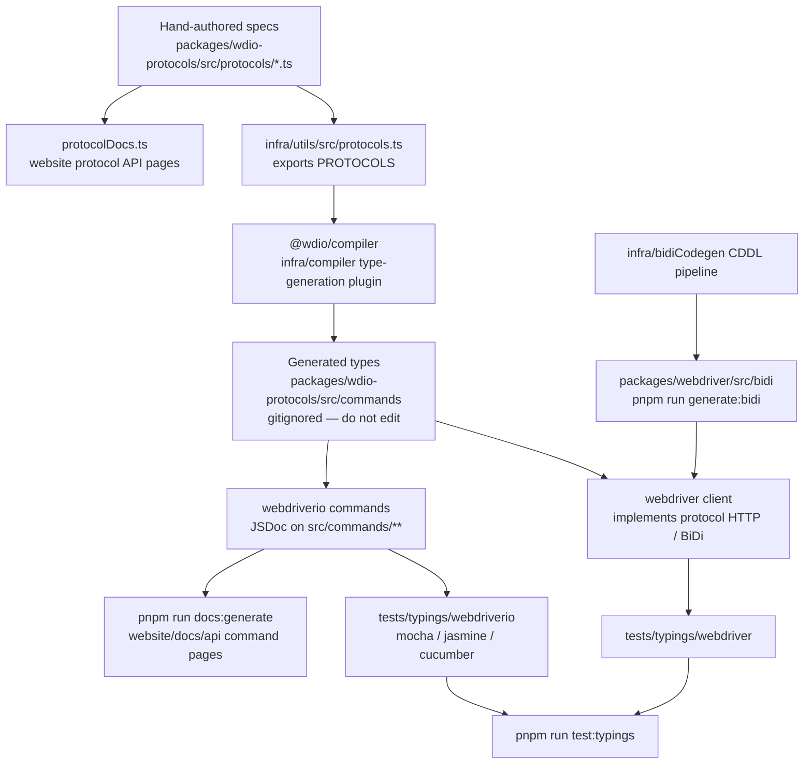

प्रोटोकॉल स्पेक्स TypeScript टाइप्स, टाइपिंग्स टेस्ट्स और API डॉक्स कैसे बनते हैं।
एजेंट्स: जनरेट की गई फ़ाइलों को मैन्युअल रूप से एडिट न करें — इस चार्ट में दिए गए सोर्स को बदलें
और पुनः जनरेट करें।

## क्या एडिट करें

| आप बदलना चाहते हैं | इसे एडिट करें | फिर चलाएँ |
|--------------------|-----------|----------|
| किसी WebDriver / Appium / वेंडर कमांड का स्वरूप | `packages/wdio-protocols/src/protocols/*.ts` | `pnpm run compile:all` और `pnpm run test:typings:webdriver` |
| कोई यूज़र-फ़ेसिंग `browser.*` / `$().*` कमांड | `packages/webdriverio/src/commands/**` साथ ही उसका यूनिट टेस्ट और टाइपिंग्स स्निपेट | `pnpm run test:package webdriverio` और `pnpm run test:typings:webdriverio` |
| BiDi टाइप्स | `infra/bidiCodegen/` | `pnpm run generate:bidi` |
| कमांड API डॉक्स टेक्स्ट | webdriverio कमांड पर JSDoc | `pnpm run docs:generate` |
| प्रोटोकॉल API डॉक्स टेक्स्ट | प्रोटोकॉल स्पेक का `description` / `ref` | `pnpm run docs:generate` |

[उच्च स्तरीय अवलोकन](/docs/flowcharts/highleveloverview) भी देखें। प्रोटोकॉल स्पेक्स
`packages/wdio-protocols` के स्वामित्व में हैं; कंपाइलर प्लगइन
`infra/compiler/src/type-generation` में स्थित है।