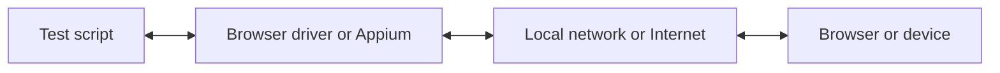

Con WebdriverIO, puoi scegliere tra diverse tecnologie di automazione quando esegui i tuoi test E2E in locale o nel cloud. Per impostazione predefinita, WebdriverIO tenterà di avviare una sessione di automazione locale utilizzando il protocollo [WebDriver Bidi](https://w3c.github.io/webdriver-bidi/).

## Protocollo WebDriver Bidi

[WebDriver Bidi](https://w3c.github.io/webdriver-bidi/) è un protocollo di automazione per automatizzare i browser tramite comunicazione bidirezionale. È il successore del protocollo [WebDriver](https://w3c.github.io/webdriver/) e offre molte più capacità di introspezione per diversi casi d'uso di testing.

Questo protocollo è attualmente in fase di sviluppo e nuove primitive potrebbero essere aggiunte in futuro. Tutti i produttori di browser si sono impegnati a implementare questo standard web e molte [primitive](https://wpt.fyi/results/webdriver/tests/bidi?label=experimental&label=master&aligned) sono già state implementate nei browser.

## Protocollo WebDriver

> [WebDriver](https://w3c.github.io/webdriver/) è un'interfaccia di controllo remoto che consente l'introspezione e il controllo degli user agent. Fornisce un protocollo di comunicazione indipendente dalla piattaforma e dal linguaggio, che permette a programmi esterni al processo di istruire da remoto il comportamento dei browser web.

Il protocollo WebDriver è stato progettato per automatizzare un browser dal punto di vista dell'utente, il che significa che tutto ciò che un utente è in grado di fare, puoi farlo anche tu con il browser. Fornisce un insieme di comandi che astraggono le interazioni comuni con un'applicazione (ad esempio, navigare, cliccare o leggere lo stato di un elemento). Essendo uno standard web, è ben supportato da tutti i principali produttori di browser ed è inoltre utilizzato come protocollo sottostante per l'automazione mobile tramite [Appium](http://appium.io).

Per utilizzare questo protocollo di automazione, è necessario un server proxy che traduca tutti i comandi e li esegua nell'ambiente di destinazione (ovvero il browser o l'app mobile).

Per l'automazione dei browser, il server proxy è solitamente il driver del browser. Sono disponibili driver per tutti i browser:

- Chrome – [ChromeDriver](http://chromedriver.chromium.org/downloads)
- Firefox – [Geckodriver](https://github.com/mozilla/geckodriver/releases)
- Microsoft Edge – [Edge Driver](https://developer.microsoft.com/en-us/microsoft-edge/tools/webdriver/)
- Internet Explorer – [InternetExplorerDriver](https://github.com/SeleniumHQ/selenium/wiki/InternetExplorerDriver)
- Safari – [SafariDriver](https://developer.apple.com/documentation/webkit/testing_with_webdriver_in_safari)

Per qualsiasi tipo di automazione mobile, dovrai installare e configurare [Appium](http://appium.io). Ti permetterà di automatizzare applicazioni mobile (iOS/Android) o persino desktop (macOS/Windows) utilizzando la stessa configurazione di WebdriverIO.

Esistono inoltre numerosi servizi che ti permettono di eseguire i tuoi test di automazione nel cloud su larga scala. Invece di dover configurare tutti questi driver in locale, puoi semplicemente comunicare con questi servizi (ad es. [Sauce Labs](https://saucelabs.com)) nel cloud e analizzare i risultati sulla loro piattaforma. La comunicazione tra lo script di test e l'ambiente di automazione è la seguente:

