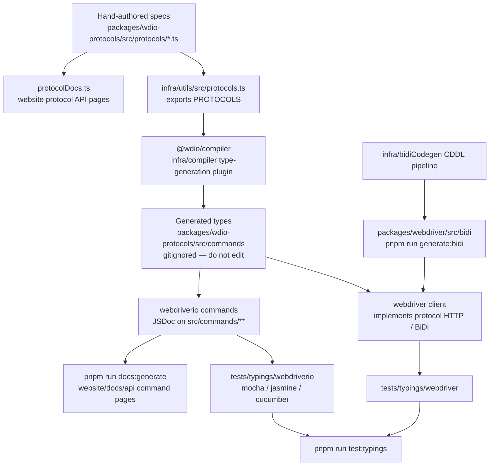

Come le specifiche dei protocolli diventano tipi TypeScript, test di tipizzazione e documentazione API.
Agenti: non modificate manualmente i file generati — modificate il sorgente indicato in questo diagramma
e rigenerate.

## Cosa modificare

| Vuoi modificare | Modifica questo | Poi esegui |
|--------------------|-----------|----------|
| La struttura di un comando WebDriver / Appium / vendor | `packages/wdio-protocols/src/protocols/*.ts` | `pnpm run compile:all` e `pnpm run test:typings:webdriver` |
| Un comando `browser.*` / `$().*` rivolto all'utente | `packages/webdriverio/src/commands/**` più il relativo unit test e lo snippet di tipizzazione | `pnpm run test:package webdriverio` e `pnpm run test:typings:webdriverio` |
| Tipi BiDi | `infra/bidiCodegen/` | `pnpm run generate:bidi` |
| Testo della documentazione API dei comandi | JSDoc sul comando webdriverio | `pnpm run docs:generate` |
| Testo della documentazione API dei protocolli | `description` / `ref` della specifica del protocollo | `pnpm run docs:generate` |

Vedi anche [Panoramica di alto livello](/docs/flowcharts/highleveloverview). Le specifiche dei protocolli sono
gestite da `packages/wdio-protocols`; il plugin del compilatore si trova in
`infra/compiler/src/type-generation`.