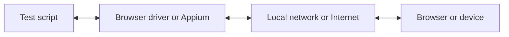

WebdriverIO では、E2E テストをローカルまたはクラウドで実行する際に、複数の自動化技術から選択できます。デフォルトでは、WebdriverIO は [WebDriver Bidi](https://w3c.github.io/webdriver-bidi/) プロトコルを使用してローカルの自動化セッションを開始しようとします。

## WebDriver Bidi プロトコル

[WebDriver Bidi](https://w3c.github.io/webdriver-bidi/) は、双方向通信を使用してブラウザを自動化するための自動化プロトコルです。これは [WebDriver](https://w3c.github.io/webdriver/) プロトコルの後継であり、さまざまなテストのユースケースに対して、より多くのイントロスペクション機能を提供します。

このプロトコルは現在開発中であり、将来的に新しいプリミティブが追加される可能性があります。すべてのブラウザベンダーがこの Web 標準の実装を約束しており、すでに多くの[プリミティブ](https://wpt.fyi/results/webdriver/tests/bidi?label=experimental&label=master&aligned)がブラウザに実装されています。

## WebDriver プロトコル

> [WebDriver](https://w3c.github.io/webdriver/) は、ユーザーエージェントのイントロスペクションと制御を可能にするリモートコントロールインターフェースです。プロセス外のプログラムが Web ブラウザの動作をリモートで指示する手段として、プラットフォームおよび言語に依存しないワイヤープロトコルを提供します。

WebDriver プロトコルは、ユーザーの視点からブラウザを自動化するように設計されています。つまり、ユーザーが行えることはすべて、ブラウザで実行できるということです。アプリケーションとの一般的なインタラクション（例：ナビゲーション、クリック、要素の状態の読み取りなど）を抽象化した一連のコマンドを提供します。Web 標準であるため、すべての主要なブラウザベンダーで十分にサポートされており、[Appium](http://appium.io) を使用したモバイル自動化の基盤となるプロトコルとしても使用されています。

この自動化プロトコルを使用するには、すべてのコマンドを変換し、ターゲット環境（つまりブラウザやモバイルアプリ）で実行するプロキシサーバーが必要です。

ブラウザの自動化では、プロキシサーバーは通常ブラウザドライバーです。すべてのブラウザで利用可能なドライバーがあります：

- Chrome – [ChromeDriver](http://chromedriver.chromium.org/downloads)
- Firefox – [Geckodriver](https://github.com/mozilla/geckodriver/releases)
- Microsoft Edge – [Edge Driver](https://developer.microsoft.com/en-us/microsoft-edge/tools/webdriver/)
- Internet Explorer – [InternetExplorerDriver](https://github.com/SeleniumHQ/selenium/wiki/InternetExplorerDriver)
- Safari – [SafariDriver](https://developer.apple.com/documentation/webkit/testing_with_webdriver_in_safari)

あらゆる種類のモバイル自動化には、[Appium](http://appium.io) をインストールしてセットアップする必要があります。これにより、同じ WebdriverIO のセットアップを使用して、モバイル（iOS/Android）やデスクトップ（macOS/Windows）アプリケーションを自動化できます。

また、自動化テストをクラウド上で大規模に実行できるサービスも数多くあります。これらすべてのドライバーをローカルでセットアップする代わりに、クラウド上のこれらのサービス（例：[Sauce Labs](https://saucelabs.com)）と通信し、そのプラットフォーム上で結果を確認するだけで済みます。テストスクリプトと自動化環境の間の通信は次のようになります：

