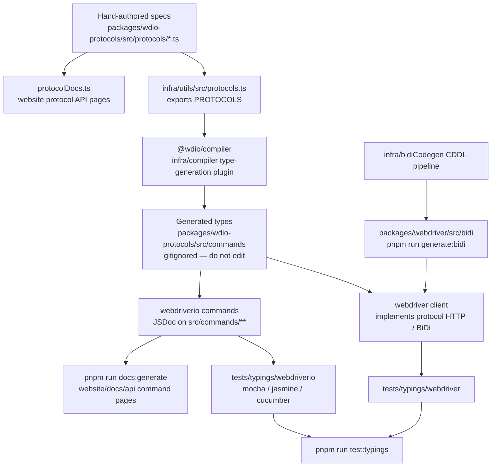

プロトコル仕様がTypeScriptの型、型付けテスト、APIドキュメントになるまでの流れ。
エージェントへ：生成されたファイルを手動で編集しないでください。このチャート内のソースを変更してから再生成してください。

## 編集する場所

| 変更したい内容 | 編集する場所 | その後に実行するコマンド |
|--------------------|-----------|----------|
| WebDriver / Appium / ベンダーコマンドの形式 | `packages/wdio-protocols/src/protocols/*.ts` | `pnpm run compile:all` および `pnpm run test:typings:webdriver` |
| ユーザー向けの `browser.*` / `$().*` コマンド | `packages/webdriverio/src/commands/**` と、その単体テストおよび型付けスニペット | `pnpm run test:package webdriverio` および `pnpm run test:typings:webdriverio` |
| BiDiの型 | `infra/bidiCodegen/` | `pnpm run generate:bidi` |
| コマンドAPIドキュメントのテキスト | webdriverioコマンドのJSDoc | `pnpm run docs:generate` |
| プロトコルAPIドキュメントのテキスト | プロトコル仕様の `description` / `ref` | `pnpm run docs:generate` |

[ハイレベルな概要](/docs/flowcharts/highleveloverview)も参照してください。プロトコル仕様は
`packages/wdio-protocols` が管理しており、コンパイラプラグインは
`infra/compiler/src/type-generation` にあります。