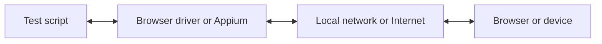

Z WebdriverIO możesz wybierać spośród wielu technologii automatyzacji podczas uruchamiania testów E2E lokalnie lub w chmurze. Domyślnie WebdriverIO spróbuje uruchomić lokalną sesję automatyzacji przy użyciu protokołu [WebDriver Bidi](https://w3c.github.io/webdriver-bidi/).

## Protokół WebDriver Bidi

[WebDriver Bidi](https://w3c.github.io/webdriver-bidi/) to protokół automatyzacji służący do automatyzacji przeglądarek z wykorzystaniem komunikacji dwukierunkowej. Jest następcą protokołu [WebDriver](https://w3c.github.io/webdriver/) i zapewnia znacznie więcej możliwości introspekcji w różnych scenariuszach testowych.

Ten protokół jest obecnie w fazie rozwoju i w przyszłości mogą zostać dodane nowe prymitywy. Wszyscy producenci przeglądarek zobowiązali się do implementacji tego standardu sieciowego, a wiele [prymitywów](https://wpt.fyi/results/webdriver/tests/bidi?label=experimental&label=master&aligned) zostało już zaimplementowanych w przeglądarkach.

## Protokół WebDriver

> [WebDriver](https://w3c.github.io/webdriver/) to interfejs zdalnego sterowania, który umożliwia introspekcję i kontrolę agentów użytkownika. Zapewnia niezależny od platformy i języka protokół komunikacyjny, pozwalający programom działającym poza procesem przeglądarki zdalnie sterować zachowaniem przeglądarek internetowych.

Protokół WebDriver został zaprojektowany do automatyzacji przeglądarki z perspektywy użytkownika, co oznacza, że wszystko, co może zrobić użytkownik, możesz zrobić z przeglądarką. Zapewnia zestaw poleceń, które abstrahują typowe interakcje z aplikacją (np. nawigację, klikanie lub odczytywanie stanu elementu). Ponieważ jest to standard sieciowy, jest dobrze obsługiwany przez wszystkich głównych producentów przeglądarek, a także jest używany jako protokół bazowy do automatyzacji mobilnej z wykorzystaniem [Appium](http://appium.io).

Aby korzystać z tego protokołu automatyzacji, potrzebujesz serwera proxy, który tłumaczy wszystkie polecenia i wykonuje je w środowisku docelowym (tj. w przeglądarce lub aplikacji mobilnej).

W przypadku automatyzacji przeglądarki serwerem proxy jest zazwyczaj sterownik przeglądarki. Sterowniki są dostępne dla wszystkich przeglądarek:

- Chrome – [ChromeDriver](http://chromedriver.chromium.org/downloads)
- Firefox – [Geckodriver](https://github.com/mozilla/geckodriver/releases)
- Microsoft Edge – [Edge Driver](https://developer.microsoft.com/en-us/microsoft-edge/tools/webdriver/)
- Internet Explorer – [InternetExplorerDriver](https://github.com/SeleniumHQ/selenium/wiki/InternetExplorerDriver)
- Safari – [SafariDriver](https://developer.apple.com/documentation/webkit/testing_with_webdriver_in_safari)

Do każdego rodzaju automatyzacji mobilnej musisz zainstalować i skonfigurować [Appium](http://appium.io). Pozwoli ci to automatyzować aplikacje mobilne (iOS/Android), a nawet desktopowe (macOS/Windows) przy użyciu tej samej konfiguracji WebdriverIO.

Istnieje również wiele usług, które pozwalają uruchamiać testy automatyczne w chmurze na dużą skalę. Zamiast konfigurować wszystkie te sterowniki lokalnie, możesz po prostu komunikować się z tymi usługami (np. [Sauce Labs](https://saucelabs.com)) w chmurze i przeglądać wyniki na ich platformie. Komunikacja między skryptem testowym a środowiskiem automatyzacji wygląda następująco:

