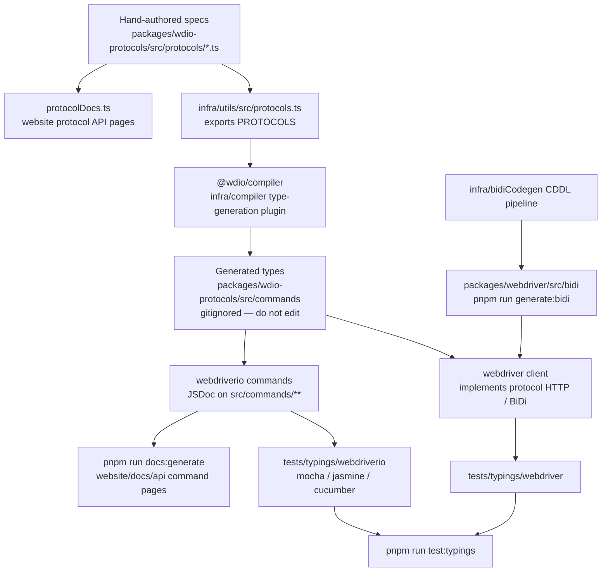

Jak specyfikacje protokołów stają się typami TypeScript, testami typowań i dokumentacją API.
Agenci: nie edytujcie ręcznie wygenerowanych plików — zmieńcie źródło wskazane na tym diagramie
i wygenerujcie pliki ponownie.

## Co edytować

| Chcesz zmienić | Edytuj to | Następnie uruchom |
|--------------------|-----------|----------|
| Kształt polecenia WebDriver / Appium / dostawcy | `packages/wdio-protocols/src/protocols/*.ts` | `pnpm run compile:all` oraz `pnpm run test:typings:webdriver` |
| Polecenie `browser.*` / `$().*` dostępne dla użytkownika | `packages/webdriverio/src/commands/**` wraz z jego testem jednostkowym i fragmentem typowań | `pnpm run test:package webdriverio` oraz `pnpm run test:typings:webdriverio` |
| Typy BiDi | `infra/bidiCodegen/` | `pnpm run generate:bidi` |
| Tekst dokumentacji API poleceń | JSDoc polecenia webdriverio | `pnpm run docs:generate` |
| Tekst dokumentacji API protokołów | `description` / `ref` w specyfikacji protokołu | `pnpm run docs:generate` |

Zobacz także [Przegląd ogólny](/docs/flowcharts/highleveloverview). Specyfikacje protokołów
należą do `packages/wdio-protocols`; wtyczka kompilatora znajduje się w
`infra/compiler/src/type-generation`.