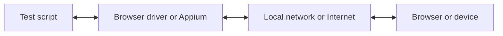

Com o WebdriverIO, você pode escolher entre várias tecnologias de automação ao executar seus testes E2E localmente ou na nuvem. Por padrão, o WebdriverIO tentará iniciar uma sessão de automação local usando o protocolo [WebDriver Bidi](https://w3c.github.io/webdriver-bidi/).

## Protocolo WebDriver Bidi

O [WebDriver Bidi](https://w3c.github.io/webdriver-bidi/) é um protocolo de automação para automatizar navegadores usando comunicação bidirecional. Ele é o sucessor do protocolo [WebDriver](https://w3c.github.io/webdriver/) e oferece muito mais recursos de introspecção para diversos casos de uso de testes.

Este protocolo está atualmente em desenvolvimento e novas primitivas podem ser adicionadas no futuro. Todos os fornecedores de navegadores se comprometeram a implementar este padrão web, e muitas [primitivas](https://wpt.fyi/results/webdriver/tests/bidi?label=experimental&label=master&aligned) já foram implementadas nos navegadores.

## Protocolo WebDriver

> O [WebDriver](https://w3c.github.io/webdriver/) é uma interface de controle remoto que permite a introspecção e o controle de agentes de usuário. Ele fornece um protocolo de comunicação neutro em relação a plataforma e linguagem, como uma forma de programas externos ao processo instruírem remotamente o comportamento de navegadores web.

O protocolo WebDriver foi projetado para automatizar um navegador a partir da perspectiva do usuário, o que significa que tudo o que um usuário é capaz de fazer, você pode fazer com o navegador. Ele fornece um conjunto de comandos que abstraem interações comuns com uma aplicação (por exemplo, navegar, clicar ou ler o estado de um elemento). Por ser um padrão web, ele é bem suportado por todos os principais fornecedores de navegadores e também é usado como protocolo subjacente para automação mobile usando o [Appium](http://appium.io).

Para usar este protocolo de automação, você precisa de um servidor proxy que traduza todos os comandos e os execute no ambiente de destino (ou seja, o navegador ou o aplicativo mobile).

Para automação de navegadores, o servidor proxy geralmente é o driver do navegador. Existem drivers disponíveis para todos os navegadores:

- Chrome – [ChromeDriver](http://chromedriver.chromium.org/downloads)
- Firefox – [Geckodriver](https://github.com/mozilla/geckodriver/releases)
- Microsoft Edge – [Edge Driver](https://developer.microsoft.com/en-us/microsoft-edge/tools/webdriver/)
- Internet Explorer – [InternetExplorerDriver](https://github.com/SeleniumHQ/selenium/wiki/InternetExplorerDriver)
- Safari – [SafariDriver](https://developer.apple.com/documentation/webkit/testing_with_webdriver_in_safari)

Para qualquer tipo de automação mobile, você precisará instalar e configurar o [Appium](http://appium.io). Ele permitirá que você automatize aplicações mobile (iOS/Android) ou até mesmo desktop (macOS/Windows) usando a mesma configuração do WebdriverIO.

Também existem muitos serviços que permitem executar seus testes de automação na nuvem em larga escala. Em vez de ter que configurar todos esses drivers localmente, você pode simplesmente se comunicar com esses serviços (por exemplo, [Sauce Labs](https://saucelabs.com)) na nuvem e inspecionar os resultados na plataforma deles. A comunicação entre o script de teste e o ambiente de automação funciona assim:

