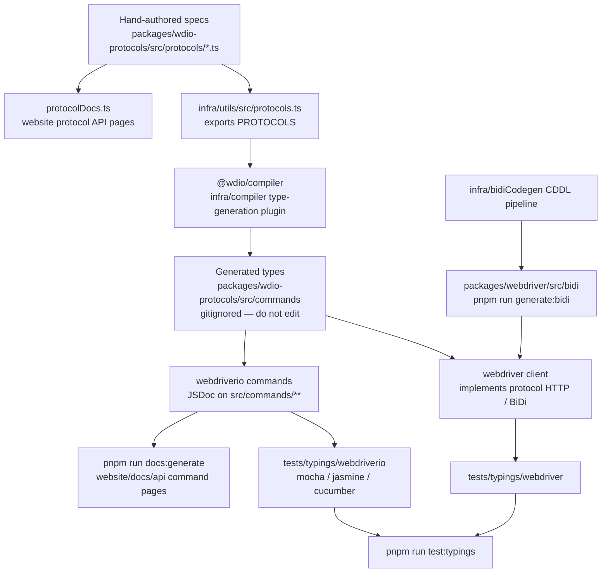

Como as especificações de protocolo se tornam tipos TypeScript, testes de tipagem e documentação da API.
Agentes: não editem manualmente os arquivos gerados — alterem a fonte neste diagrama
e regenerem.

## O que editar

| Você quer alterar | Edite isto | Depois execute |
|--------------------|-----------|----------|
| O formato de um comando WebDriver / Appium / de fornecedor | `packages/wdio-protocols/src/protocols/*.ts` | `pnpm run compile:all` e `pnpm run test:typings:webdriver` |
| Um comando `browser.*` / `$().*` voltado ao usuário | `packages/webdriverio/src/commands/**` mais seu teste unitário e trecho de tipagem | `pnpm run test:package webdriverio` e `pnpm run test:typings:webdriverio` |
| Tipos BiDi | `infra/bidiCodegen/` | `pnpm run generate:bidi` |
| Texto da documentação da API de comandos | JSDoc no comando do webdriverio | `pnpm run docs:generate` |
| Texto da documentação da API de protocolos | `description` / `ref` da especificação do protocolo | `pnpm run docs:generate` |

Veja também [Visão geral de alto nível](/docs/flowcharts/highleveloverview). As especificações de protocolo
pertencem a `packages/wdio-protocols`; o plugin do compilador fica em
`infra/compiler/src/type-generation`.