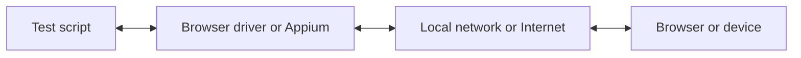

С WebdriverIO вы можете выбирать между несколькими технологиями автоматизации при запуске E2E-тестов локально или в облаке. По умолчанию WebdriverIO пытается запустить локальную сессию автоматизации с использованием протокола [WebDriver Bidi](https://w3c.github.io/webdriver-bidi/).

## Протокол WebDriver Bidi

[WebDriver Bidi](https://w3c.github.io/webdriver-bidi/) — это протокол автоматизации браузеров, использующий двунаправленную связь. Он является преемником протокола [WebDriver](https://w3c.github.io/webdriver/) и предоставляет значительно больше возможностей для интроспекции в различных сценариях тестирования.

Этот протокол в настоящее время находится в разработке, и в будущем могут быть добавлены новые примитивы. Все производители браузеров взяли на себя обязательство реализовать этот веб-стандарт, и многие [примитивы](https://wpt.fyi/results/webdriver/tests/bidi?label=experimental&label=master&aligned) уже реализованы в браузерах.

## Протокол WebDriver

> [WebDriver](https://w3c.github.io/webdriver/) — это интерфейс удалённого управления, который обеспечивает интроспекцию и управление пользовательскими агентами. Он предоставляет независимый от платформы и языка сетевой протокол, позволяющий внешним программам удалённо управлять поведением веб-браузеров.

Протокол WebDriver был разработан для автоматизации браузера с точки зрения пользователя, то есть всё, что может сделать пользователь, можете сделать и вы с помощью браузера. Он предоставляет набор команд, абстрагирующих типичные взаимодействия с приложением (например, навигацию, клики или чтение состояния элемента). Поскольку это веб-стандарт, он хорошо поддерживается всеми основными производителями браузеров, а также используется в качестве базового протокола для мобильной автоматизации с помощью [Appium](http://appium.io).

Чтобы использовать этот протокол автоматизации, вам нужен прокси-сервер, который транслирует все команды и выполняет их в целевой среде (т. е. в браузере или мобильном приложении).

Для автоматизации браузеров прокси-сервером обычно является драйвер браузера. Драйверы доступны для всех браузеров:

- Chrome – [ChromeDriver](http://chromedriver.chromium.org/downloads)
- Firefox – [Geckodriver](https://github.com/mozilla/geckodriver/releases)
- Microsoft Edge – [Edge Driver](https://developer.microsoft.com/en-us/microsoft-edge/tools/webdriver/)
- Internet Explorer – [InternetExplorerDriver](https://github.com/SeleniumHQ/selenium/wiki/InternetExplorerDriver)
- Safari – [SafariDriver](https://developer.apple.com/documentation/webkit/testing_with_webdriver_in_safari)

Для любой мобильной автоматизации вам потребуется установить и настроить [Appium](http://appium.io). Он позволит автоматизировать мобильные (iOS/Android) или даже десктопные (macOS/Windows) приложения с использованием той же настройки WebdriverIO.

Также существует множество сервисов, которые позволяют запускать автоматизированные тесты в облаке в большом масштабе. Вместо того чтобы настраивать все эти драйверы локально, вы можете просто взаимодействовать с этими сервисами (например, [Sauce Labs](https://saucelabs.com)) в облаке и просматривать результаты на их платформе. Взаимодействие между тестовым скриптом и средой автоматизации выглядит так:

