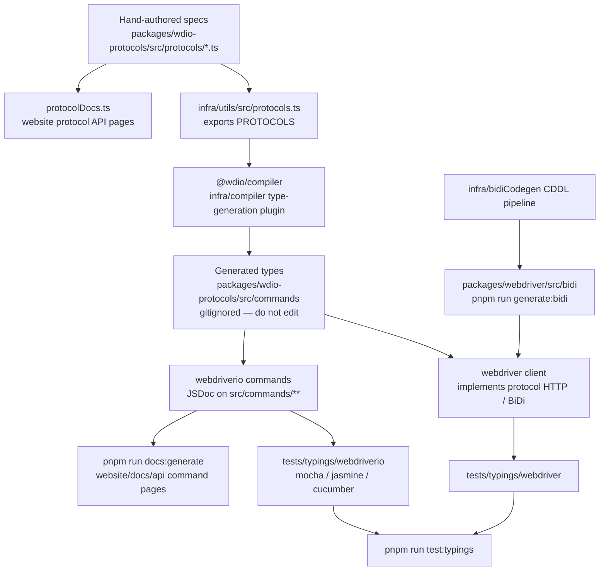

Как спецификации протоколов превращаются в типы TypeScript, тесты типизации и документацию API.
Агентам: не редактируйте сгенерированные файлы вручную — измените исходный файл, указанный на этой схеме,
и выполните повторную генерацию.

## Что редактировать

| Что вы хотите изменить | Что редактировать | Что затем запустить |
|--------------------|-----------|----------|
| Структуру команды WebDriver / Appium / вендора | `packages/wdio-protocols/src/protocols/*.ts` | `pnpm run compile:all` и `pnpm run test:typings:webdriver` |
| Пользовательскую команду `browser.*` / `$().*` | `packages/webdriverio/src/commands/**`, а также её модульный тест и фрагмент типизации | `pnpm run test:package webdriverio` и `pnpm run test:typings:webdriverio` |
| Типы BiDi | `infra/bidiCodegen/` | `pnpm run generate:bidi` |
| Текст документации API команд | JSDoc в команде webdriverio | `pnpm run docs:generate` |
| Текст документации API протоколов | `description` / `ref` в спецификации протокола | `pnpm run docs:generate` |

См. также [Общий обзор](/docs/flowcharts/highleveloverview). Спецификации протоколов
находятся в пакете `packages/wdio-protocols`; плагин компилятора расположен в
`infra/compiler/src/type-generation`.