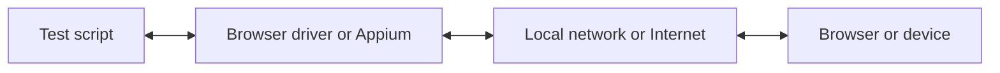

Med WebdriverIO kan du välja mellan flera automatiseringstekniker när du kör dina E2E-tester lokalt eller i molnet. Som standard försöker WebdriverIO starta en lokal automatiseringssession med protokollet [WebDriver Bidi](https://w3c.github.io/webdriver-bidi/).

## WebDriver Bidi-protokollet

[WebDriver Bidi](https://w3c.github.io/webdriver-bidi/) är ett automatiseringsprotokoll för att automatisera webbläsare med hjälp av dubbelriktad kommunikation. Det är efterföljaren till protokollet [WebDriver](https://w3c.github.io/webdriver/) och ger betydligt fler möjligheter till introspektion för olika testscenarier.

Protokollet är för närvarande under utveckling och nya primitiver kan komma att läggas till i framtiden. Alla webbläsartillverkare har åtagit sig att implementera denna webbstandard, och många [primitiver](https://wpt.fyi/results/webdriver/tests/bidi?label=experimental&label=master&aligned) har redan implementerats i webbläsarna.

## WebDriver-protokollet

> [WebDriver](https://w3c.github.io/webdriver/) är ett fjärrstyrningsgränssnitt som möjliggör introspektion och kontroll av användaragenter. Det tillhandahåller ett plattforms- och språkneutralt överföringsprotokoll som gör det möjligt för program som körs i separata processer att fjärrstyra webbläsares beteende.

WebDriver-protokollet utformades för att automatisera en webbläsare ur användarens perspektiv, vilket innebär att allt en användare kan göra kan du också göra med webbläsaren. Det tillhandahåller en uppsättning kommandon som abstraherar bort vanliga interaktioner med en applikation (t.ex. att navigera, klicka eller läsa av ett elements tillstånd). Eftersom det är en webbstandard har det bra stöd hos alla stora webbläsartillverkare och används också som underliggande protokoll för mobilautomatisering med [Appium](http://appium.io).

För att använda detta automatiseringsprotokoll behöver du en proxyserver som översätter alla kommandon och utför dem i målmiljön (dvs. webbläsaren eller mobilappen).

För webbläsarautomatisering är proxyservern vanligtvis webbläsardrivrutinen. Det finns drivrutiner tillgängliga för alla webbläsare:

- Chrome – [ChromeDriver](http://chromedriver.chromium.org/downloads)
- Firefox – [Geckodriver](https://github.com/mozilla/geckodriver/releases)
- Microsoft Edge – [Edge Driver](https://developer.microsoft.com/en-us/microsoft-edge/tools/webdriver/)
- Internet Explorer – [InternetExplorerDriver](https://github.com/SeleniumHQ/selenium/wiki/InternetExplorerDriver)
- Safari – [SafariDriver](https://developer.apple.com/documentation/webkit/testing_with_webdriver_in_safari)

För all typ av mobilautomatisering behöver du installera och konfigurera [Appium](http://appium.io). Det gör att du kan automatisera mobilapplikationer (iOS/Android) eller till och med skrivbordsapplikationer (macOS/Windows) med samma WebdriverIO-konfiguration.

Det finns också många tjänster som låter dig köra dina automatiseringstester i molnet i stor skala. I stället för att behöva konfigurera alla dessa drivrutiner lokalt kan du helt enkelt kommunicera med dessa tjänster (t.ex. [Sauce Labs](https://saucelabs.com)) i molnet och granska resultaten på deras plattform. Kommunikationen mellan testskriptet och automatiseringsmiljön ser ut så här:

