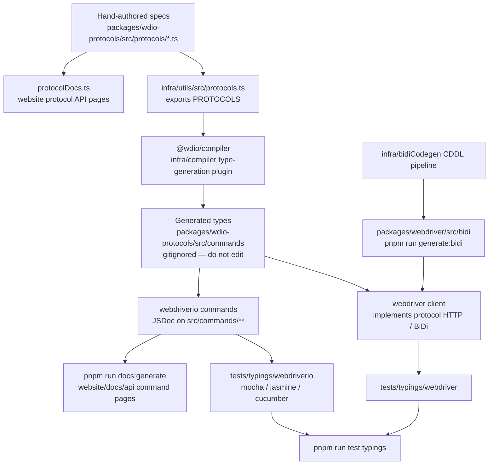

Hur protokollspecifikationer blir TypeScript-typer, typningstester och API-dokumentation.
Agenter: redigera inte genererade filer för hand – ändra källan i detta diagram
och generera om.

## Vad du ska redigera

| Du vill ändra | Redigera detta | Kör sedan |
|--------------------|-----------|----------|
| Formen på ett WebDriver-/Appium-/leverantörskommando | `packages/wdio-protocols/src/protocols/*.ts` | `pnpm run compile:all` och `pnpm run test:typings:webdriver` |
| Ett användarvänt `browser.*`-/`$().*`-kommando | `packages/webdriverio/src/commands/**` samt dess enhetstest och typningsexempel | `pnpm run test:package webdriverio` och `pnpm run test:typings:webdriverio` |
| BiDi-typer | `infra/bidiCodegen/` | `pnpm run generate:bidi` |
| Text i kommandots API-dokumentation | JSDoc på webdriverio-kommandot | `pnpm run docs:generate` |
| Text i protokollets API-dokumentation | protokollspecifikationens `description` / `ref` | `pnpm run docs:generate` |

Se även [Översikt på hög nivå](/docs/flowcharts/highleveloverview). Protokollspecifikationerna
ägs av `packages/wdio-protocols`; kompilatorpluginet finns i
`infra/compiler/src/type-generation`.