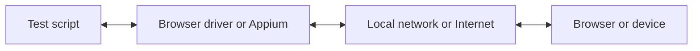

WebdriverIO மூலம், உங்கள் E2E சோதனைகளை உள்ளூரிலோ அல்லது கிளவுடிலோ இயக்கும்போது பல ஆட்டோமேஷன் தொழில்நுட்பங்களில் ஒன்றைத் தேர்வுசெய்யலாம். இயல்பாக, WebdriverIO [WebDriver Bidi](https://w3c.github.io/webdriver-bidi/) நெறிமுறையைப் பயன்படுத்தி ஒரு உள்ளூர் ஆட்டோமேஷன் அமர்வைத் தொடங்க முயற்சிக்கும்.

## WebDriver Bidi நெறிமுறை

[WebDriver Bidi](https://w3c.github.io/webdriver-bidi/) என்பது இருதிசைத் தொடர்பைப் பயன்படுத்தி உலாவிகளைத் தானியக்கமாக்கும் ஒரு ஆட்டோமேஷன் நெறிமுறையாகும். இது [WebDriver](https://w3c.github.io/webdriver/) நெறிமுறையின் வாரிசாகும், மேலும் பல்வேறு சோதனை பயன்பாட்டு நிகழ்வுகளுக்கு மிக அதிகமான உள்நோக்கு (introspection) திறன்களை வழங்குகிறது.

இந்த நெறிமுறை தற்போது உருவாக்கத்தில் உள்ளது, எதிர்காலத்தில் புதிய அடிப்படைக் கூறுகள் (primitives) சேர்க்கப்படலாம். அனைத்து உலாவி விற்பனையாளர்களும் இந்த வலைத் தரநிலையைச் செயல்படுத்த உறுதியளித்துள்ளனர், மேலும் பல [அடிப்படைக் கூறுகள்](https://wpt.fyi/results/webdriver/tests/bidi?label=experimental&label=master&aligned) ஏற்கனவே உலாவிகளில் சேர்க்கப்பட்டுள்ளன.

## WebDriver நெறிமுறை

> [WebDriver](https://w3c.github.io/webdriver/) என்பது பயனர் முகவர்களின் (user agents) உள்நோக்கு மற்றும் கட்டுப்பாட்டைச் செயல்படுத்தும் ஒரு தொலைக் கட்டுப்பாட்டு இடைமுகமாகும். செயல்முறைக்கு வெளியே உள்ள நிரல்கள் வலை உலாவிகளின் நடத்தையைத் தொலைவிலிருந்து அறிவுறுத்துவதற்கான ஒரு வழியாக, தளம் மற்றும் மொழி சார்பற்ற வயர் நெறிமுறையை இது வழங்குகிறது.

WebDriver நெறிமுறை பயனரின் கண்ணோட்டத்திலிருந்து உலாவியைத் தானியக்கமாக்க வடிவமைக்கப்பட்டது, அதாவது ஒரு பயனர் செய்யக்கூடிய அனைத்தையும் நீங்கள் உலாவியில் செய்ய முடியும். இது ஒரு பயன்பாட்டுடனான பொதுவான தொடர்புகளை (எ.கா., வழிசெலுத்துதல், கிளிக் செய்தல் அல்லது ஒரு உறுப்பின் நிலையைப் படித்தல்) சுருக்கும் கட்டளைகளின் தொகுப்பை வழங்குகிறது. இது ஒரு வலைத் தரநிலை என்பதால், அனைத்து முக்கிய உலாவி விற்பனையாளர்களாலும் நன்கு ஆதரிக்கப்படுகிறது, மேலும் [Appium](http://appium.io) பயன்படுத்தி மொபைல் ஆட்டோமேஷனுக்கான அடிப்படை நெறிமுறையாகவும் பயன்படுத்தப்படுகிறது.

இந்த ஆட்டோமேஷன் நெறிமுறையைப் பயன்படுத்த, அனைத்து கட்டளைகளையும் மொழிபெயர்த்து இலக்குச் சூழலில் (அதாவது உலாவி அல்லது மொபைல் பயன்பாடு) செயல்படுத்தும் ஒரு ப்ராக்ஸி சர்வர் உங்களுக்குத் தேவை.

உலாவி ஆட்டோமேஷனுக்கு, ப்ராக்ஸி சர்வர் பொதுவாக உலாவி டிரைவர் ஆகும். அனைத்து உலாவிகளுக்கும் டிரைவர்கள் கிடைக்கின்றன:

- Chrome – [ChromeDriver](http://chromedriver.chromium.org/downloads)
- Firefox – [Geckodriver](https://github.com/mozilla/geckodriver/releases)
- Microsoft Edge – [Edge Driver](https://developer.microsoft.com/en-us/microsoft-edge/tools/webdriver/)
- Internet Explorer – [InternetExplorerDriver](https://github.com/SeleniumHQ/selenium/wiki/InternetExplorerDriver)
- Safari – [SafariDriver](https://developer.apple.com/documentation/webkit/testing_with_webdriver_in_safari)

எந்த வகையான மொபைல் ஆட்டோமேஷனுக்கும், நீங்கள் [Appium](http://appium.io)-ஐ நிறுவி அமைக்க வேண்டும். அதே WebdriverIO அமைப்பைப் பயன்படுத்தி மொபைல் (iOS/Android) அல்லது டெஸ்க்டாப் (macOS/Windows) பயன்பாடுகளைக் கூட தானியக்கமாக்க இது உங்களை அனுமதிக்கும்.

உங்கள் ஆட்டோமேஷன் சோதனையை கிளவுடில் பெரிய அளவில் இயக்க அனுமதிக்கும் பல சேவைகளும் உள்ளன. இந்த டிரைவர்கள் அனைத்தையும் உள்ளூரில் அமைப்பதற்குப் பதிலாக, கிளவுடில் உள்ள இந்தச் சேவைகளுடன் (எ.கா. [Sauce Labs](https://saucelabs.com)) நேரடியாகத் தொடர்புகொண்டு, அவற்றின் தளத்தில் முடிவுகளை ஆய்வு செய்யலாம். சோதனை ஸ்கிரிப்ட் மற்றும் ஆட்டோமேஷன் சூழலுக்கு இடையேயான தொடர்பு இவ்வாறு இருக்கும்:

